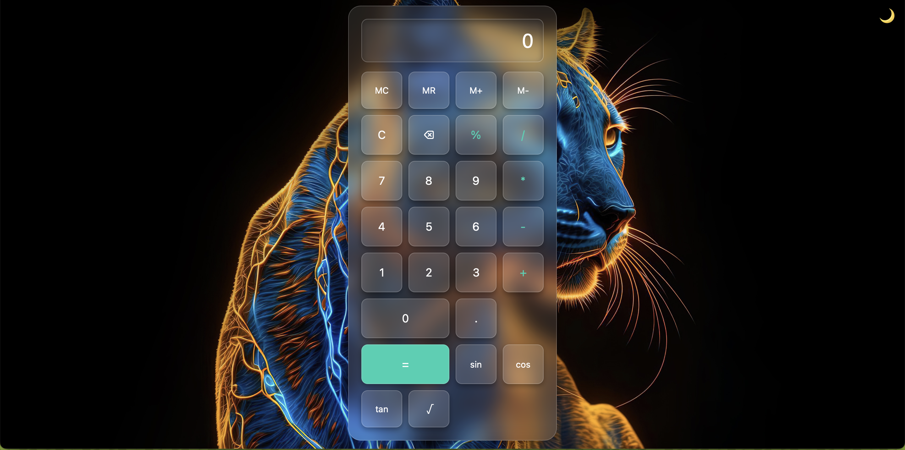

# FutureIntern_WD_02
### Screenshot
Here's a screenshot of the calculator app in action:



# Calculator Web Application

This is a **Responsive Calculator Web Application** built using **HTML**, **CSS**, and **JavaScript**. It is designed to perform basic arithmetic calculations as well as advanced scientific operations like trigonometric functions (`sin`, `cos`, `tan`), square roots, and memory operations. The calculator also supports **Dark Mode** for better user experience in low-light environments.

### Features
- **Basic Arithmetic Operations**: Add, Subtract, Multiply, Divide
- **Scientific Functions**: `sin`, `cos`, `tan`, square roots, and more
- **Memory Operations**: `M+`, `M-`, `MR`, `MC`
- **Responsive Design**: Adjusts to all screen sizes (mobile, tablet, desktop)
- **Dark Mode**: Toggle between light and dark themes for a personalized experience
- **User Input Display**: Display the current calculation as input and shows result after pressing equals (`=`)

### Technologies Used
- **HTML**: Structure and layout of the web page
- **CSS**: Styling and design of the calculator
  - **Responsive Design**: Media queries to ensure proper scaling and layout on different devices
  - **Glassmorphism Style**: Modern design with glass-like effects
- **JavaScript**: Logic for calculations, memory operations, and scientific functions

### Installation

1. **Clone the repository**:
   ```bash
   git clone https://github.com/yourusername/calculator-web-app.git
   ```

2. **Navigate to the project folder**:
   ```bash
   cd calculator-web-app
   ```

3. **Open the `index.html` file in your preferred browser** to start using the calculator.

### Features Breakdown

1. **Basic Calculator Functions**:
   - Allows basic arithmetic operations like addition, subtraction, multiplication, and division.
   - Input can be entered through the calculator UI or directly on the screen using the numeric keypad.

2. **Scientific Calculator Functions**:
   - Performs trigonometric calculations like `sin`, `cos`, and `tan`.
   - Supports square roots, exponentiation, and other standard scientific operations.

3. **Memory Operations**:
   - `M+`: Adds the current value to memory.
   - `M-`: Subtracts the current value from memory.
   - `MR`: Recalls the value stored in memory.
   - `MC`: Clears the memory.

4. **Responsive Design**:
   - The layout adjusts dynamically to various screen sizes, making it suitable for all devices, including mobile phones, tablets, laptops, and desktops.
   - The grid-based layout ensures that buttons are properly sized and do not overflow or cut off.

5. **Dark Mode**:
   - Users can toggle between Light Mode and Dark Mode to suit their preference and the surrounding lighting conditions.

### How to Use
1. **Basic Operations**:
   - Click on the buttons for numbers and operations to perform the desired calculation.
   - Press the `=` button to display the result.
   - You can reset the calculator using the `C` button.

2. **Scientific Operations**:
   - For advanced calculations, use the `sin`, `cos`, and `tan` buttons along with the numeric buttons.
   - Press `=` to get the result of the trigonometric function.

3. **Memory Operations**:
   - Store values using `M+` (add to memory) or `M-` (subtract from memory).
   - Recall the stored value with `MR` (Memory Recall).
   - Clear the memory with `MC`.

4. **Toggle Dark Mode**:
   - Click on the theme switcher button (top right corner) to toggle between Light Mode and Dark Mode.


### Future Improvements
- Add more advanced mathematical functions (logarithms, factorials, etc.).
- Implement keyboard support for easier input.
- Improve accessibility with proper focus styles and ARIA labels.

### Contributions
Feel free to fork this repository and make any improvements! If you find any bugs or issues, please open an issue or submit a pull request.

### License
This project is open source and available under the [MIT License](LICENSE).

